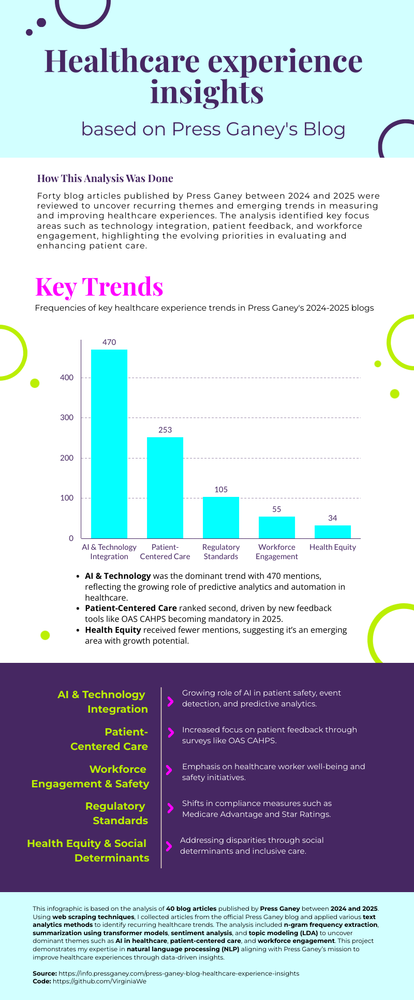

# Healthcare Experience Trends Analysis from Press Ganey Blogs (2024-2025)

## Overview
This project focuses on analyzing 40 blog articles published by **Press Ganey** between **2024** and **2025** to uncover recurring themes and emerging trends in measuring and improving healthcare experiences. The project applies a range of text analytics techniques to highlight key focus areas such as **technology integration**, **patient feedback**, and **workforce engagement**.

## Project Goals
- Identify dominant trends in healthcare experience evaluation and patient satisfaction.
- Demonstrate expertise in **Natural Language Processing (NLP)** and **data visualization**.
- Create actionable insights that align with Press Ganey’s mission to improve healthcare experiences.

## Methodology
The project involves two main phases:

1. **Web Scraping**: Articles were collected from Press Ganey's blog using Python libraries like **BeautifulSoup** and **Requests**.
2. **Text Analysis**: The collected content was processed using various **NLP** techniques:
   - **N-gram Frequency Analysis**: To detect common terms and phrases.
   - **Named Entity Recognition (NER)**: To identify organizations, people, and locations.
   - **Topic Modeling (LDA)**: To extract underlying themes across articles.
   - **Sentiment Analysis**: Using both **TextBlob** and **transformer-based models** to gauge the tone.
   - **Summarization**: Condensing lengthy articles using transformer models like **T5-small**.
   
The final results were visualized using **matplotlib** and **seaborn**, and compiled into an infographic on piktochart for easy interpretation.

## Key Findings
Five major trends were identified:
1. **AI & Technology Integration**: Growing use of AI in patient safety and predictive analytics.
2. **Patient-Centered Care**: Emphasis on patient feedback mechanisms like OAS CAHPS.
3. **Workforce Engagement & Safety**: Focus on healthcare worker well-being.
4. **Regulatory Standards**: Shifts in compliance with Medicare and Medicaid guidelines.
5. **Health Equity & Social Determinants**: Addressing disparities in healthcare access.

## Visualization
An infographic summarizing the trends and their frequency across blog posts is included in the repository:  


## Project Structure 
``` Healthcare-Trends-Analysis/ │ ├── Scraper.ipynb # Web scraping script for Press Ganey articles ├── TextAnalysis_PGBlog.ipynb # Text analytics and trend analysis ├── TextAnalysis_PGBlog.png # Final infographic summarizing key trends ├── requirements.txt # List of required Python packages └── README.md # Project documentation ``` 

## Contact For questions or collaboration opportunities, feel free to reach out: 

**Virginia Wenger** 
📧 [virginia.wenger@gmail.com](mailto:virginia.wenger@gmail.com) 
💻 [GitHub Profile](https://github.com/VirginiaWe) 


